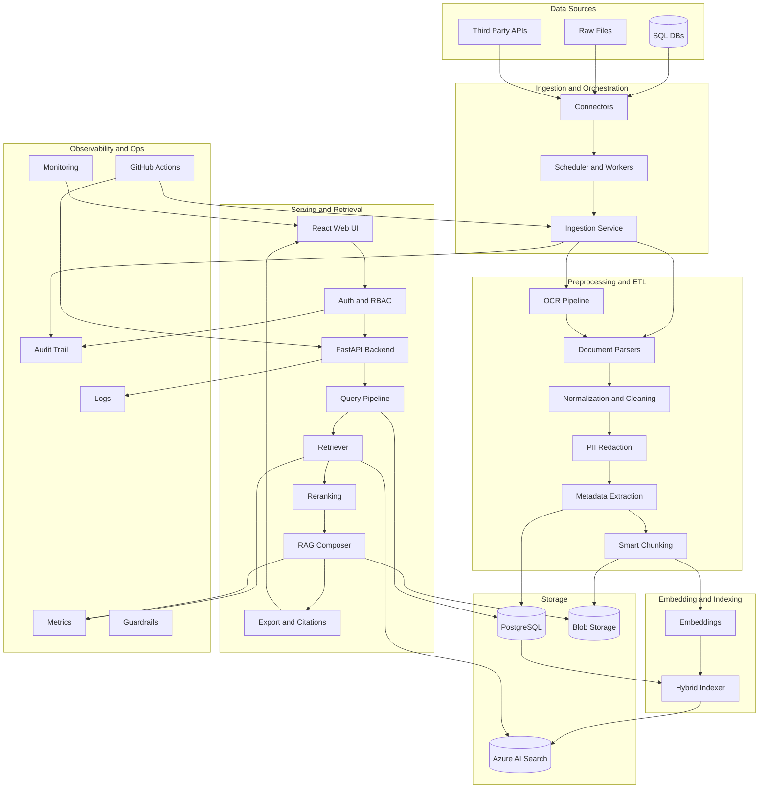

# Kcube Talent Finder

**Recruit the Talent with AI: No Manual Hassle, No Complex Processes**

Automate SQL and raw data processing with the best practices of **Data Engineering** and **OCR**, powered by AI.  
This project enables businesses to find the right candidates quickly and efficiently without manual filtering.

---

## Problem Statement
Businesses were struggling with **manual recruitment processes**, handling over **60,000 files** (≈15 GB cumulative data) dispersed across SQL databases and raw files of inconsistent formats.  

Challenges included:
- Highly **time-consuming** and **error-prone** manual screening.  
- **Dispersed data** in SQL and unstructured files.  
- **Non-uniform formats** making automation difficult.  

---

## Solution Provided
Kcube AI developed an **AI-powered recruitment solution** that transformed the candidate selection process:  

- Parsed and preprocessed 60K+ raw files using advanced **Data Engineering** pipelines.  
- Applied **OCR techniques** to extract valuable insights from complex documents.  
- Cleaned, structured, and stored all data into a **Vector Database** for efficient AI search.  
- Integrated with **SQL databases** and external file systems.  
- Built an intuitive **Web UI** where employees can simply type prompts to filter candidates instantly.  

---

## Key Features
- AI-driven **semantic search** over structured + unstructured data.  
- **OCR-powered document parsing** for heterogeneous file formats.  
- Integration with multiple data sources (SQL + raw files).  
- **Scalable backend services** with CI/CD automation.  
- **Conversational interface** to query recruitment data.  

---

## Tech Stack
| Technology                | Purpose |
|----------------------------|---------|
| **Azure AI Search**        | Vector database & semantic search |
| **Azure OpenAI**           | Conversational AI & embeddings |
| **React**                  | Web-based user interface |
| **FastAPI**                | Scalable backend services |
| **PostgreSQL**             | Secure structured data storage |
| **OCR & Data Engineering** | Document parsing & preprocessing |
| **GitHub Actions (CI/CD)** | Automated deployment pipeline |

---

## Data Flow Diagram

---

## Live Link
👉 [Kcube AI](https://kcube.ai)

---

## Case Study Visual

---

## About Kcube AI
Kcube AI is an **AI-first IT services company** specializing in:  
- AI Web & Mobile Development  
- Data Engineering, AI/ML/NLP Solutions  
- Power Apps & Power BI Integrations  
- Cloud Solutions with Microsoft Azure  

Visit us at: [kcube.ai](https://kcube.ai)
